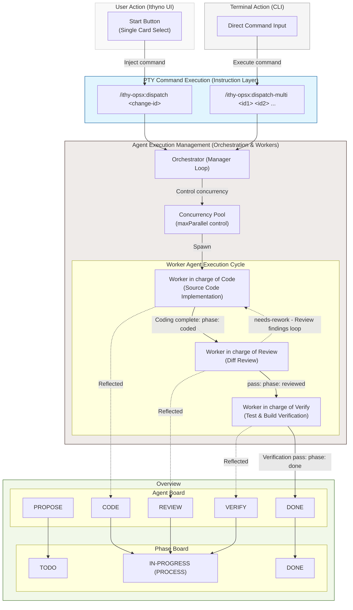

# Relationship Between OpenSpec and Agent

This document describes the relationship and architecture between the OpenSpec workflow and the agents (Agent / Manager / Worker) in Ithyno.

---

## Agent Role and Relationship

Instead of humans manually dragging cards to advance phases, Ithyno uses an **agent-driven architecture** where the board displays the results of agent actions.

### Board as a State Monitor
Users cannot manually drag cards between columns to change their internal phase (e.g., from coding to review).
Phase transitions are written automatically by the **Manager agent** as it completes each step, and these updates are pushed to the Kanban board via WebSockets in real time.

### Separation of Instruction Layer (OpenSpec) and State Management (Agent)
Ithyno separates the instructions given to agents from the resulting states (statuses) generated by agent execution.

* **Instruction Layer (OpenSpec Commands)**
  * The layer used to instruct agents on what actions to perform. Commands (instructions) such as `/opsx:propose`, `/opsx:apply`, `/opsx:archive`, and `/ithy-opsx:merge` are issued by the user or the system.
* **Agent State Management (Execution Status)**
  * The internal progress state (phase) determined as a result of the agent executing those instructions.
  * **Correspondence between instructions and states**:
    * Execution of `propose` command ───→ `proposed` state
    * Execution of `apply` command ───→ `coded` state
    * Result of `review` execution ───→ `reviewed` state
    * Result of `verify` execution ───→ `done` state

### Separation of Interactive Escalations (needs-human)
When an agent encounters ambiguous requirements, it escalates to the `needs-human` state.
* **Ithyno (UI)**: The Kanban card simply displays a badge indicating the waiting status. There are no interactive dialogs or input forms on the board.
* **PTY (Terminal)**: Interactive Q&A and conversations with the agent are handled entirely inside the terminal session (e.g., Claude Code PTY). Once the user responds and the agent completes its run, it writes the phase update back to the filesystem, automatically updating the Kanban board.

---

## Agent Startup and Dispatching (dispatch / dispatch-multi)

When a user clicks the "Start" button on the Kanban board or executes a command in the terminal, a dispatch process runs under the hood to spawn and manage agents. There are two dispatching mechanisms: `dispatch` for single changes and `dispatch-multi` for processing multiple changes in parallel.

### Dispatching Mechanisms
* **Single Dispatch (`/ithy-opsx:dispatch <change-id>`)**:
  * Triggered when a user clicks "Start" on a single card in the Kanban board (or runs it from the terminal). Spawns the agent (Manager / Worker) for the specified change ID.
* **Multi-Dispatch (`/ithy-opsx:dispatch-multi <id1> <id2> ...`)**:
  * Triggered when a user inputs and executes the command directly in the PTY terminal.
  * Manages and executes agents in a concurrency pool governed by the concurrency limit (`maxParallel`: defaults to 10) defined in `agents.yaml`.

### Code and Review Feedback Loop
During the agent execution cycle, a feedback loop runs between the **Code Worker** and the **Review Worker** to ensure implementation quality:
* **Code to Review**: Once the Code Worker finishes the code implementation, the state transitions to `coded`, which automatically triggers the Review Worker.
* **Rejection (needs-rework)**: If the review detects issues (spec violations, bugs, etc.) and returns a `needs-rework` verdict, the review findings are piped back to the Code Worker, which restarts the implementation process (forming a loop).
* **Approval (pass)**: Only when the review verdict becomes `pass` is the phase updated to `reviewed`, allowing the process to advance to verification by the Verify Worker.
* **Preventing Infinite Loops (maxReworkRounds)**: If the loop reaches the maximum rework rounds limit defined in `agents.yaml` (`maxReworkRounds`: defaults to 5), the automated process halts to avoid an infinite loop and escalates to the `needs-human` state (or terminates).

### Agent Dispatch and State Synchronization Flow

The execution cycle of worker agents (Code / Review / Verify), the resulting states (`coded` / `reviewed` / `done`), and how they map to the two UI layouts (Phase Board / Agent Board) are illustrated below:

