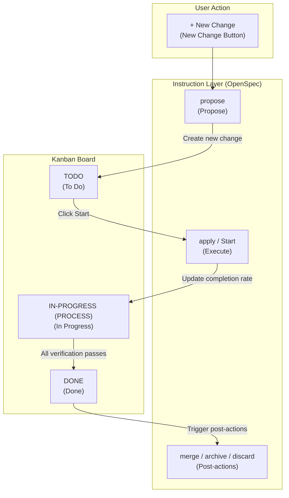
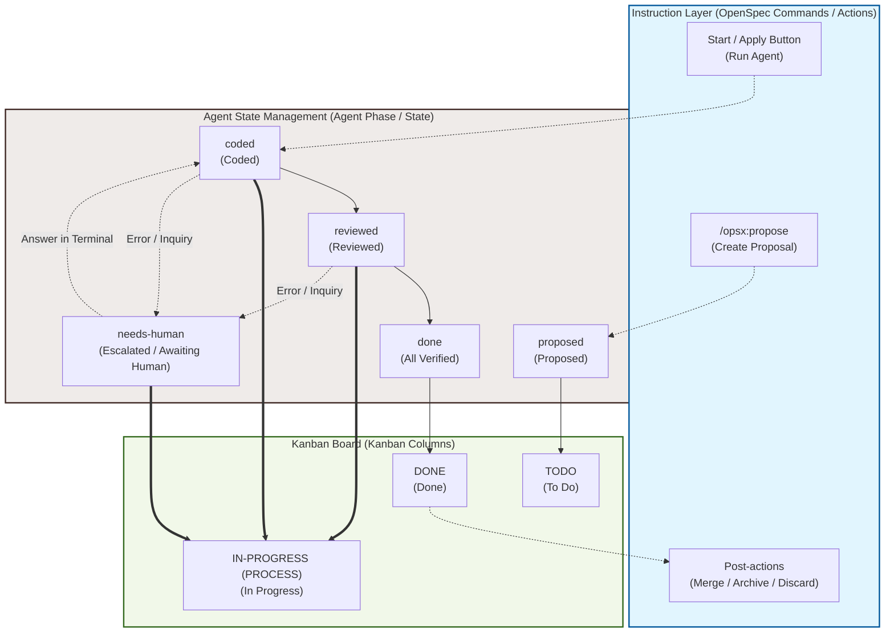

# Relationship Between OpenSpec and Kanban Board

This document describes the relationship and architecture between the OpenSpec workflow and the Kanban Board visualizer in Ithyno.

---

## Phase Board (Phase Kanban / Former Classic Kanban) Structure

The Phase board (former Classic Kanban board) in Ithyno is a **state monitor** that visualizes the lifecycle of OpenSpec changes. It is designed with a classic three-column layout (TODO, IN-PROGRESS, DONE) to help users easily track the completion status of their changes.

### TODO
* **Meaning**: Changes that have been proposed (Propose step) but have not yet started implementation or verification by an agent.
* **User Actions**:
  * `+ New Change`: Create a new proposal document.
  * `Start` / `Apply`: Spawn an agent (implementer) to begin processing the change.

### IN-PROGRESS (PROCESS)
* **Meaning**: Changes that are currently undergoing implementation (coding), review, or automated test verification.
* **Key Features**:
  * Displays the task completion rate (percentage based on completed checkboxes in `tasks.md`).
  * Indicates that an agent is actively running or that a human review/verification step is underway.
  * Changes escalated to `needs-human` (awaiting input/feedback from a human) remain in this column.

### DONE
* **Meaning**: Changes where all implementation, review, and verification steps have completed successfully.
* **User Actions**:
  * `Merge`: Merge the change into the main branch (cleans up the worktree).
  * `Archive`: Archive the completed change.
  * `Discard`: Withdraw and discard the change.

## Basic Mapping: Kanban Board and Instruction Layer (OpenSpec)

The diagram below shows the direct relationship between the Kanban board columns (TODO / IN-PROGRESS / DONE) and the OpenSpec instruction commands (actions) executed by the user.

---

## Lifecycle and Detailed State Transitions Map

The detailed lifecycle, including internal agent states (`proposed`, `coded`, `reviewed`, `done`) and interactive escalation loops (`needs-human`), is mapped below.

