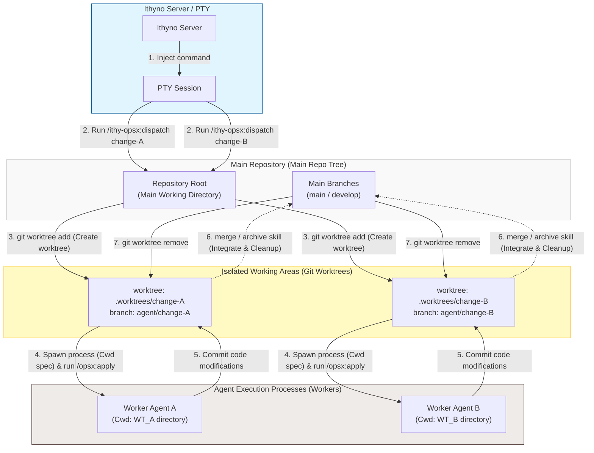

# Relationship Between Git Worktrees, Dispatching, and Agents

This document explains the mechanism of directory isolation via **Git Worktrees**, agent command **Dispatching**, and their execution environment in Ithyno to achieve safe parallel execution.

---

## 1. Directory Isolation for Parallel Execution (Git Worktree)

When agents implement and verify multiple changes in parallel, executing them within the same directory would cause file conflicts and git commit collisions. To prevent this, Ithyno leverages `git worktree`, a standard Git feature, to dynamically create isolated working directories for each change.

* **Worktree Directory Path**: `.worktrees/<change-id>/`
* **Working Git Branch**: `agent/<change-id>`

This isolation allows multiple agents to compile, build, test, and edit source code in completely independent workspaces without polluting the repository root or interfering with each other.

---

## 2. Dispatch and Worktree Spawning Flow

When a dispatch command is triggered and an agent starts, a worktree is prepared under the hood, and the agent's action command is executed there using the following flow:

1. **Execute Dispatch (Main Environment)**:
   When a user clicks "Start" in the UI or runs `/ithy-opsx:dispatch <change-id>` in the PTY terminal on the main workspace directory (active `main` branch), the Ithyno server registers the change task.
2. **Create Isolated Worktree (`git worktree add`)**:
   The Ithyno server executes the following Git command from the main workspace directory to dynamically create an isolated worktree directory and its corresponding branch:
   ```bash
   git worktree add .worktrees/<change-id> -b agent/<change-id>
   ```
3. **Isolate Agent's Working Directory (Cwd)**:
   When spawning the agent process, the execution engine sets the **`cwd` (Current Working Directory)** option to the absolute path of the newly created `.worktrees/<change-id>/`.
4. **Independent Agent Runs (Worktree)**:
   The spawned worker agents (Code / Review / Verify) run entirely inside the isolated `cwd` directory (the worktree folder). For example, the `code` agent automatically executes **`/opsx:apply <change-id>`** inside this worktree directory to edit, verify, and commit files based on `proposal.md` and `tasks.md` independently.

---

## 3. Post-execution Cleanup (Merge, Archive, and Discard)

Once agent execution is complete and the change reaches the `done` state, or if the user decides to "Discard" the change in the middle, cleanup processes are run to remove the now-redundant worktree.

* **Cleanup via Merge / Archive Skills**:
  * When a user triggers merge or archive, the corresponding instruction layer skills (**`/ithy-opsx:merge`** or **`/ithy-opsx:archive`**) are executed.
  * In the final step of these skills (`Cleanup (ask)`), the engine interactively (or automatically) removes the git worktree and deletes the local agent branch.
* **Direct Cleanup on Discard**:
  * If the user selects "Discard" in the UI, the cleanup git commands are directly injected and executed in the terminal (PTY) to force-delete both the worktree and branch:
    ```bash
    git worktree remove --force .worktrees/<change-id>
    git branch -D agent/<change-id>
    ```

---

## 4. Architectural Relationship Diagram

The diagram below maps the relationships between the Main Repo Tree, the Ithyno Server, the PTY, the isolated Git Worktrees, and the spawned worker agents.


