

<section class="ithyno-hero">
  

    
OpenSpec × AI agent workflows

    <h1>Make spec-driven development visible.</h1>
    
ithyno connects OpenSpec changes with role-based AI agents, isolated Git worktrees, and a local dashboard—from proposal to completion.

    

      <a class="md-button md-button--primary" href="installation/">Install and get started</a>
      <a class="md-button" href="project-creation-flow/">Create your first project</a>
      <a class="ithyno-text-link" href="https://github.com/fluentdb-dev/ithyno">View on GitHub →</a>
    

  

  <figure class="ithyno-hero__visual">
    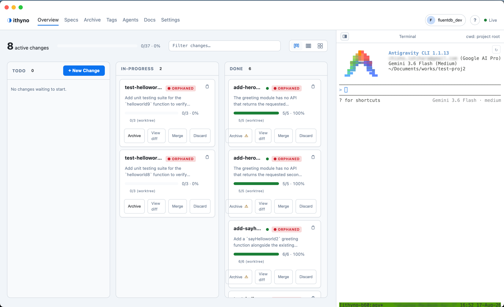
  </figure>
</section>

<section class="ithyno-pillars" aria-label="ithyno principles">
  <article><strong>OpenSpec first</strong>Specifications and tasks remain plain Markdown.</article>
  <article><strong>Role-based agents</strong>Delegate code, review, and verify separately.</article>
  <article><strong>Isolated execution</strong>Run different changes in independent Git worktrees.</article>
  <article><strong>Local and inspectable</strong>Review artifacts, diffs, and history in your repository.</article>
</section>

<section class="ithyno-section ithyno-section--center">
  
One controlled workflow

  <h2>From proposal to completed change</h2>
  
Keep each stage explicit. The Manager delegates work, agents produce inspectable artifacts, and you decide when a change is ready to merge and archive.

  

    <b>1</b>Propose<i>→</i><b>2</b>Code<i>→</i><b>3</b>Review<i>→</i><b>4</b>Verify<i>→</i><b>5</b>Merge &amp; archive
  

  

    <figure>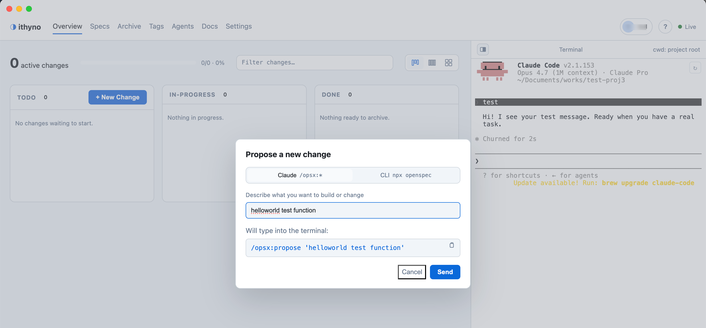<figcaption>Describe the change</figcaption></figure>
    <figure>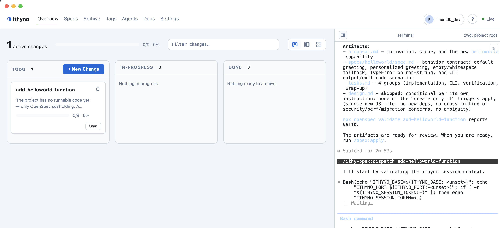<figcaption>Dispatch the right worker</figcaption></figure>
    <figure>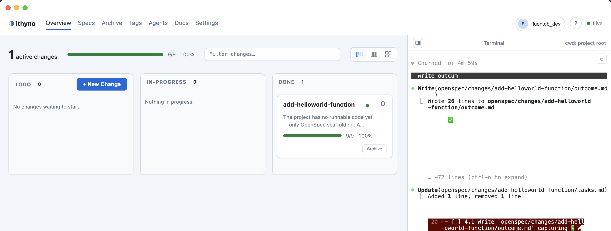<figcaption>Inspect the result</figcaption></figure>
  

</section>

<section class="ithyno-feature">
  

    
Dashboard + Manager

    <h2>See the workflow while it runs</h2>
    
Track every Change on the board while keeping the Manager terminal beside it. Copy a Change ID from its card, dispatch it, and follow the work without leaving the project view.

    <a href="multi-agent-execution-flow/">See the multi-agent execution flow →</a>
  

  <figure>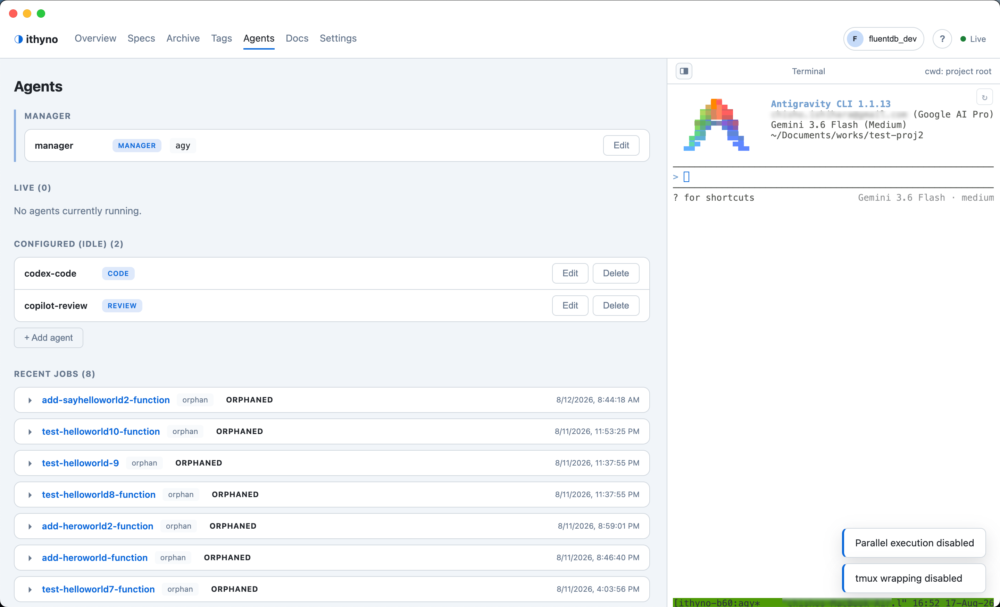</figure>
</section>

<section class="ithyno-feature ithyno-feature--reverse">
  

    
OpenSpec remains the source of truth

    <h2>Your specifications stay readable</h2>
    
ithyno does not replace OpenSpec with a private state store. It presents the specifications, tasks, outcomes, and archived changes already stored in your repository.

    <a href="architecture/openspec-kanban/">How OpenSpec connects to the dashboard →</a>
  

  <figure>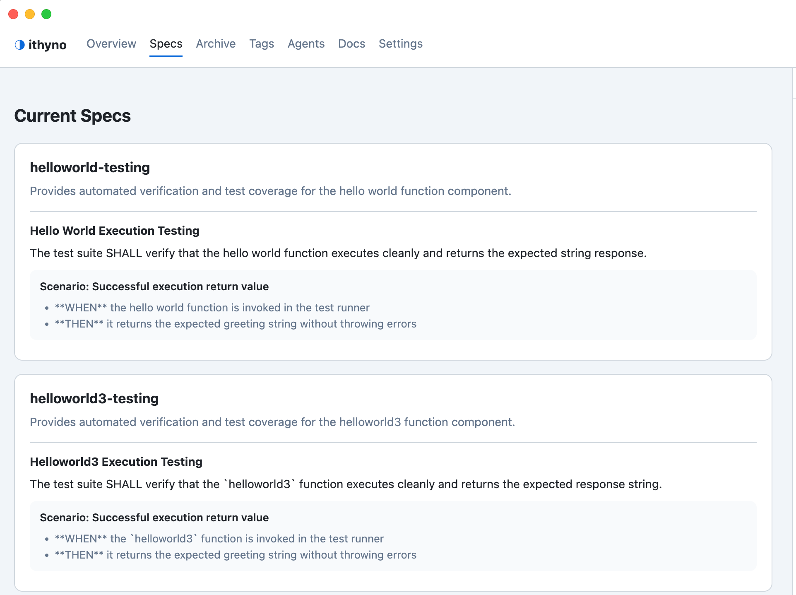</figure>
</section>

<section class="ithyno-section ithyno-agents-block">
  

    

Controlled multi-agent work
<h2>Assign the right CLI to each role</h2>

    
Configure a Manager and separate code, review, and verify workers. Different changes can run in parallel; the stages of one change remain ordered and reviewable.

  

  

    <figure>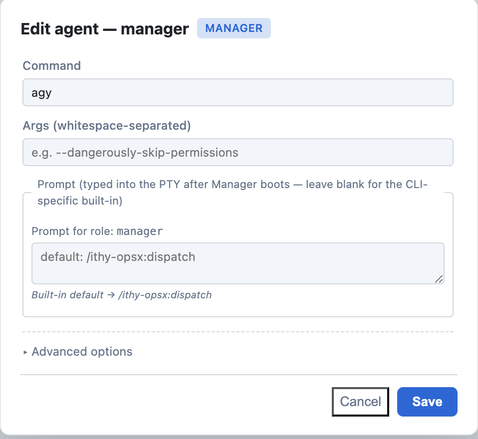<figcaption>Manager</figcaption></figure>
    <figure>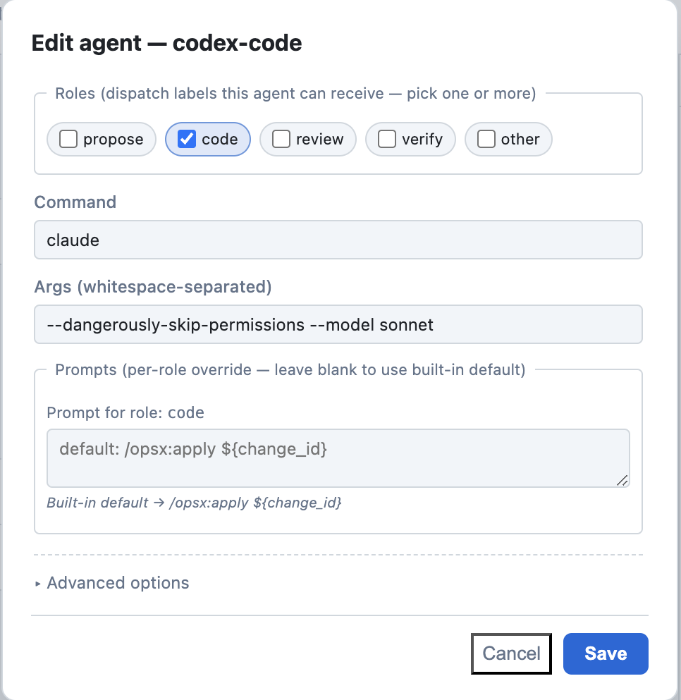<figcaption>Code</figcaption></figure>
    <figure>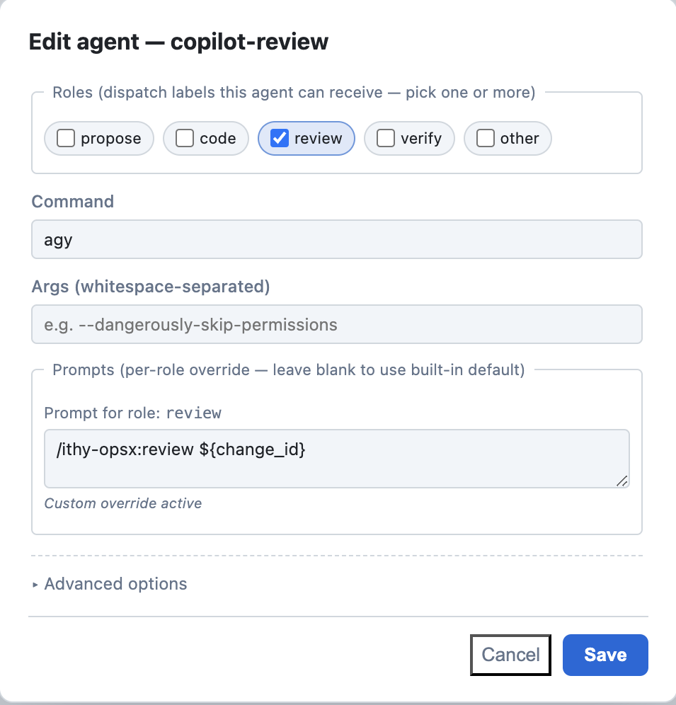<figcaption>Review</figcaption></figure>
  

  
<a href="multi-agent-setup-and-dispatch/">Configure multiple agents and check verified CLI routes →</a>

</section>

<section class="ithyno-section ithyno-section--center">
  
Choose your workspace

  <h2>Use ithyno where you work</h2>
  

    <article>
      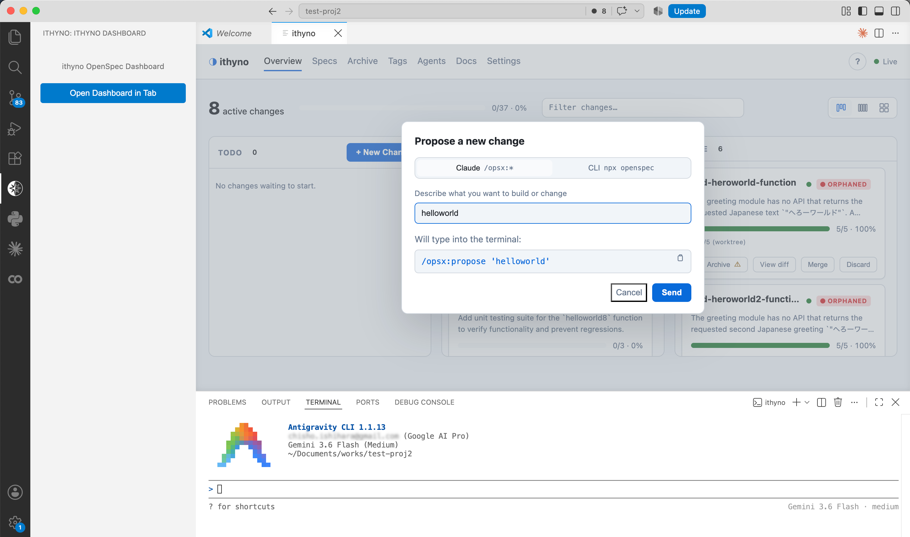
      
<h3>VS Code Extension</h3>
Keep changes and the Manager alongside your editor.
<a href="project-creation-flow/#vs-code">Start with VS Code →</a>

    </article>
    <article>
      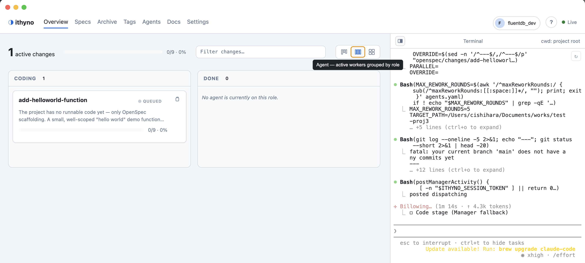
      
<h3>Electron App</h3>
Manage a project from a dedicated desktop window.
<a href="project-creation-flow/#electron-app">Start with Electron →</a>

    </article>
  

</section>

<section class="ithyno-section ithyno-advanced">
  

    

Start simple, extend when needed
<h2>Advanced execution is optional</h2>

    
Add worktree parallelism, a persistent tmux Manager session, agmsg communication, and per-CLI skills when your workflow needs them.

  

  

    <a href="architecture/openspec-worktree/"><strong>Git worktrees</strong>Isolate concurrently active changes.</a>
    <a href="advanced/tmux-and-agmsg/"><strong>tmux &amp; agmsg</strong>Keep sessions alive and connect agents.</a>
    <a href="skill-capabilities/"><strong>Agent skills</strong>Understand the capabilities installed for each CLI.</a>
  

</section>

<section class="ithyno-get-started">
  
Get started

  <h2>Your first Change in three steps</h2>
  <ol><li><b>Install</b>Prepare Git, Node.js, and ithyno.</li><li><b>Initialize</b>Connect a new or existing project to OpenSpec.</li><li><b>Create and dispatch</b>Define a Change, then hand it to the Manager.</li></ol>
  
<a class="md-button md-button--primary" href="installation/">Install ithyno</a><a class="md-button" href="project-creation-flow/">Follow the simple project guide</a>

</section>

<section class="ithyno-final-cta">
  <h2>Keep specifications, agents, and Git changes connected.</h2>
  
Start locally and keep every step inspectable.

  <a class="md-button md-button--primary" href="https://github.com/fluentdb-dev/ithyno/releases">Download from GitHub Releases</a>
</section>

