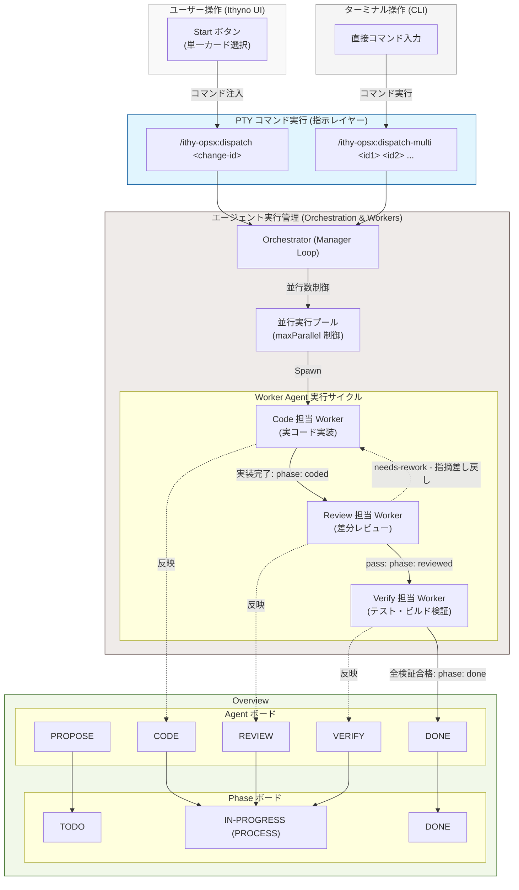

# OpenSpec とエージェントの関係

Ithyno における OpenSpec ワークフローと、それを処理するエージェント（Agent / Manager / Worker）のアーキテクチャおよび役割について説明します。

---

## エージェント (Agent) の役割と関係

Ithyno は、人間が直接かんばん上でカードをドラッグして進捗を制御するのではなく、**エージェントが処理した結果を画面に反映する**設計（エージェント主導型アーキテクチャ）を採用しています。

### ステータスモニターとしての挙動
ユーザーがかんばんボード上で手動でカードをドラッグしてフェーズ（開発、レビュー、完了など）を動かすことはできません。
進行フェーズの変更は、裏で動く **Manager エージェント** が各ステップを完了したタイミングで状態を自動的に更新し、それが WebSocket を通じてかんばんボードにリアルタイムに反映されます。

### 指示レイヤー（OpenSpec）と状態管理（エージェント）の分離
Ithyno では、エージェントへの「指示（コマンド）」とその実行結果による「状態（ステータス）」が明確に分離されています。

* **指示レイヤー（OpenSpecのコマンド）**
  * エージェントに対して何をすべきかを指示するレイヤーです。ユーザーまたはシステムから `/opsx:propose` / `/opsx:apply` / `/opsx:archive` / `/ithy-opsx:merge` などのコマンド（指示）が発行されます。
* **エージェントによる状態管理（実行結果のステータス）**
  * 指示を受けたエージェントが処理を実行した結果として決定される、内部的な進捗状態（フェーズ）です。
  * **指示と状態の対応関係**:
    * `propose` 指示の実行結果 ───→ `proposed` 状態（提案済）
    * `apply` 指示の実行結果 ───→ `coded` 状態（実装済）
    * `review`（レビュー実行）の結果 ───→ `reviewed` 状態（レビュー済）
    * `verify`（検証実行）の結果 ───→ `done` 状態（検証完了・完了済）

### 人手介入（needs-human）時の対話の分離
エージェントが実装や検証の途中で曖昧な要件に直面した場合、エスカレーション状態（`needs-human`）になります。
* **Ithyno (UI)**: ボード上では「対応待ち」のバッジ等で状態を示すにとどまり、UI 自体には回答フォームや対話用モーダルは存在しません。
* **PTY (ターミナル)**: ユーザーとエージェントとの対話（質問回答や調整）は、Pty ターミナル（Claude Code などの対話セッション）内で直接テキストで行われます。ユーザーがターミナルで回答してエージェントが再開・完了すると、自動的にかんばんボードのステータスが更新されます。

---

## エージェントの起動とディスパッチ（dispatch / dispatch-multi）

ユーザーがかんばんボード上の「Start」ボタンを押す、またはターミナルからコマンドを実行すると、裏でエージェントを起動・制御するディスパッチ（Dispatch）処理が走ります。これには単一の変更を処理する `dispatch` と、複数の変更を並行処理する `dispatch-multi` の2つのメカニズムが存在します。

### ディスパッチの仕組み
* **単一ディスパッチ (`/ithy-opsx:dispatch <change-id>`)**:
  * ユーザーがかんばんボード上で特定のカードの「Start」ボタンを押した際（またはターミナルから実行した際）に、対象の変更IDに対してエージェント（Manager / Worker）を起動します。
* **複数並行ディスパッチ (`/ithy-opsx:dispatch-multi <id1> <id2> ...`)**:
  * ユーザーが PTY ターミナルから直接コマンドを入力して実行します。
  * `agents.yaml` で定義された並行数上限（`maxParallel`：デフォルトは 10）に従い、エージェントをプール（Queue）で並行実行・制御します。

### Code と Review のフィードバックループ
エージェントの実行サイクル中、実装と検証の品質を保証するために **Code 担当 Worker** と **Review 担当 Worker** の間でフィードバックループが回ります。
* **コード実装からレビューへ**: Code 担当 Worker が実装を終えると、フェーズが `coded` になり、自動的に Review 担当 Worker が起動します。
* **差し戻し（needs-rework）**: レビューで問題（仕様違反、バグなど）が検出されて判定が `needs-rework` となった場合、指摘内容（findings）が Code 担当 Worker へパイプされ、再度コード修正プロセスに戻ります（ループの形成）。
* **レビュー合格（pass）**: レビュー判定が `pass` となって初めてフェーズが `reviewed` に更新され、次の Verify 担当 Worker の検証フェーズへと進むことができます。
* **無限ループの防止（maxReworkRounds）**: `agents.yaml` で定義された最大修正ラウンド数（`maxReworkRounds`：デフォルトは 5）に達すると、無限ループを避けるためにエージェントの自動実行を停止し、人手介入が必要な `needs-human` 状態（または終了）へ移行します。

### エージェント起動と状態遷移のフロー図

エージェント（Code / Review / Verify）の実行プロセス、それによる状態（`coded` / `reviewed` / `done`）の決定、および UI レベルでの2種類の可視化方法（Phase ボード / Agent ボード）のマッピングは以下の通りです。

