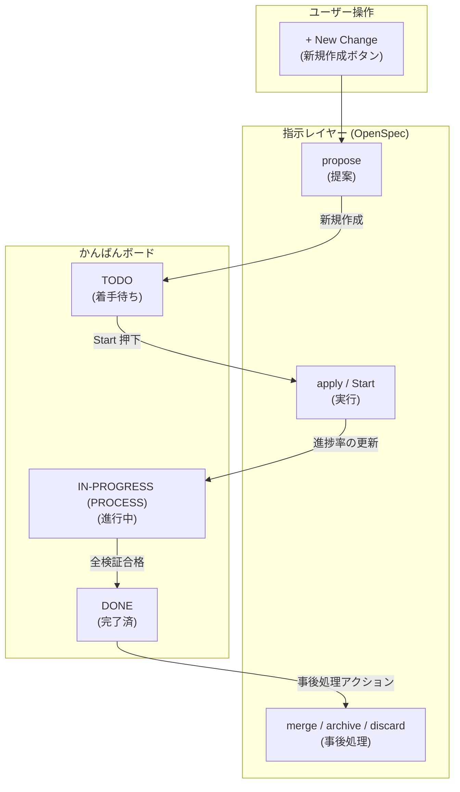
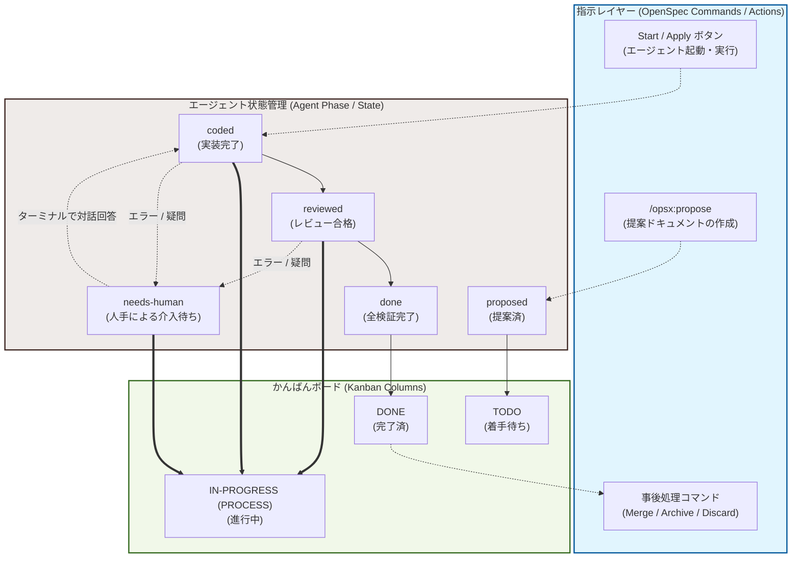

# OpenSpec とかんばんボードの関係

Ithyno における OpenSpec ワークフローと、それを可視化するかんばんボード（Kanban Board）のアーキテクチャおよび関係性について説明します。

---

## Phase ボード（フェーズかんばん / 旧 Classic かんばん）の構成

Ithyno の Phase ボード（旧 Classic かんばんボード）は、OpenSpec の変更（Changes）のライフサイクルを可視化するための **ステータスモニター（State Monitor）** です。クラシックな 3 カラム構成で設計されており、各変更の進行状況（タスク完了率など）を直感的に把握できます。

### TODO
* **意味**: 提案（Propose）された段階で、まだエージェントによる実装や検証が開始されていない変更。
* **ユーザーアクション**:
  * `+ New Change`：新規の提案ドキュメントの作成。
  * `Start` / `Apply`：変更に対してエージェント（実装担当者）を起動して処理を開始する。

### IN-PROGRESS (PROCESS)
* **意味**: エージェントによる実装（コーディング）、レビュー、またはテスト検証が実際に進行している状態の変更。
* **表示と特徴**:
  * カード上にタスクの進捗率（`tasks.md` 内の完了数に基づくパーセンテージ）が表示されます。
  * エージェントが裏で処理を実行中であること、またはレビュー中の段階であることを示します。
  * エージェントが処理中に判断に迷い、人手による回答待ち（`needs-human`）のステータスになっているカードもこのカラムに留まります。

### DONE
* **意味**: エージェントによる実装と検証のすべてが完了した変更。
* **ユーザーアクション**:
  * `Merge`：実装内容をメインブランチにマージする（作業ツリーのクリーンアップを伴う）。
  * `Archive`：完了した変更をアーカイブする。
  * `Discard`：変更を取り下げる（廃棄する）。

## かんばんボードと指示レイヤー（OpenSpec）の基本対応

かんばんボード（TODO / IN-PROGRESS / DONE）のカラムと、ユーザーが実行する OpenSpec 指示コマンド（アクション）の直接的な対応関係は以下の通りです。

---

## ライフサイクルと詳細な状態変化マップ

エージェントの内部的な状態管理（`proposed`, `coded`, `reviewed`, `done` および `needs-human` による一時停止と対話ループ）を含む、詳細なライフサイクルは以下の通りです。

