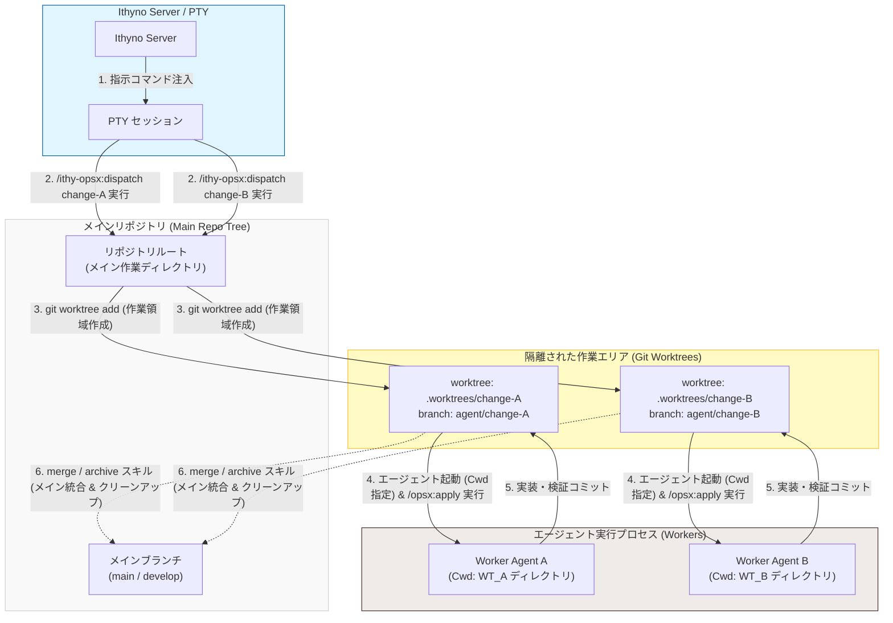

# Git Worktree とディスパッチ、エージェントの関係

Ithyno における並行実行を実現するための **Git Worktree（作業ツリー）** と、指示コマンドの **ディスパッチ（Dispatch）**、および **エージェント（Agent）** の実行ディレクトリ隔離の仕組みについて解説します。

---

## 1. 並行実行のための作業ディレクトリ隔離 (Git Worktree)

エージェントが複数の変更（Changes）を並行して実装・検証する際、同一の作業ツリーで処理を行うとファイルの競合や競合コミットが発生します。これを防ぐため、Ithyno は Git の標準機能である `git worktree` を用いて、変更ごとに隔離された作業ディレクトリを動的に生成します。

* **Worktree パス**: `.worktrees/<change-id>/`
* **作業ブランチ**: `agent/<change-id>`

これにより、メインの作業ディレクトリ（リポジトリのルート）を汚すことなく、複数のエージェントが完全に独立した環境で並行してコードの修正やビルド・テスト検証を実行することができます。

---

## 2. ディスパッチと Worktree 生成フロー

指示コマンドがディスパッチされ、エージェントが起動される際、裏では以下のフローで自動的に Worktree が準備され、そこでエージェント実行コマンドが実行されます。

1. **ディスパッチの実行 (メイン環境)**:
   ユーザーが UI の Start ボタンを押す、またはメイン作業ディレクトリ（`main` ブランチ）上で起動している PTY ターミナルにて `/ithy-opsx:dispatch <change-id>` コマンドを実行します。これにより、Ithyno Server が処理タスクを登録します。
2. **分離作業エリアの作成（git worktree add）**:
   Ithyno Server はメイン作業ディレクトリ上で以下の Git コマンドを実行し、隔離された Worktree と対応するエージェント用ブランチを動的に作成します。
   ```bash
   git worktree add .worktrees/<change-id> -b agent/<change-id>
   ```
3. **エージェントの Cwd (作業ディレクトリ) の隔離指定**:
   エージェントを起動（Spawn）する際、プロセス実行オプションの **`cwd`（Current Working Directory）** に、新しく作成した `.worktrees/<change-id>/` の絶対パスを指定します。
4. **隔離環境下でのエージェント実行 (Worktree)**:
   エージェント（Code / Review / Verify）は、隔離された `cwd`（Worktree フォルダ）内で起動されます。たとえば Code ロールのエージェントは、この Worktree 内で自動的に **`/opsx:apply <change-id>`** を実行し、提案（proposal.md）とタスク（tasks.md）に沿って独立したファイルの編集・検証・コミットを行います。

---

## 3. マージ・アーカイブ・破棄時のクリーンアップ

エージェントの処理が完了し、変更が `done` 状態になった後の事後処理（マージ・アーカイブ）、または途中で作業を止める「破棄（Discard）」のタイミングで、不要になった Worktree のクリーンアップが実行されます。

* **マージ・アーカイブ・スキルによるクリーンアップ**:
  * ユーザーがマージやアーカイブをトリガーすると、指示レイヤーである **`/ithy-opsx:merge`** または **`/ithy-opsx:archive`** スキルが実行されます。
  * これらのスキルは、マージやアーカイブのコミットを完了した後の最終ステップ（`Cleanup (ask)`）として、Worktree の削除およびエージェント用ローカルブランチの削除を対話的（または自動）に実行します。
* **破棄（Discard）時の直接クリーンアップ**:
  * ユーザーが UI 上で「Discard」を選択した場合、以下のクリーンアップ用 Git コマンドが直接ターミナル（PTY）に注入・実行され、Worktree とブランチが強制削除されます。
    ```bash
    git worktree remove --force .worktrees/<change-id>
    git branch -D agent/<change-id>
    ```

---

## 4. アーキテクチャ構成図

メイン作業ディレクトリ、ディスパッチ、分離された Git Worktree、およびエージェントの物理的な関係は以下の通りです。


