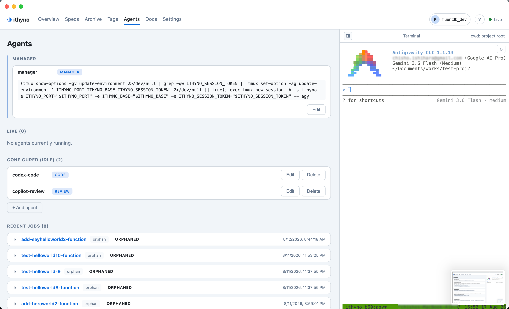

# Set Up Multiple Agents and Dispatch a Change

Ithyno uses one persistent **Manager** and one or more **workers**.
The Manager receives the dispatch command, reads `agents.yaml`, and delegates
each stage to a worker with the matching role.

```text
Start / dispatch
      ↓
Manager ──→ code worker ──→ review worker ──→ verify worker
```

The stages are sequential for one change. Different changes can run in
parallel when parallel execution is enabled.

## 1. Prepare every CLI

Install and authenticate every agent CLI you plan to use. Installing skill
files does not install or sign in to the CLI itself.

In ithyno:

1. Open **Settings → Prerequisites**.
2. Confirm that each CLI is detected.
3. Select **Manage skills** for each Manager and worker CLI.
4. Install both **OpenSpec** and **ithyno skills** when they are supported.

Do this for the receiving worker as well as the Manager. A worker must be able
to resolve the prompt it receives, such as the OpenSpec apply workflow or the
ithyno review workflow.

## 2. Assign the roles

Open **Agents** and use **+ Add agent** to create workers. Assign these
standard roles:

| Role | Responsibility | Built-in workflow |
|---|---|---|
| `manager` | Orchestrates the change and delegates work | ithyno dispatch |
| `code` | Implements unchecked OpenSpec tasks | OpenSpec apply |
| `review` | Reviews the implementation and writes `review.md` | ithyno review |
| `verify` | Runs applicable checks and writes `review.md` | ithyno verify |

Set a custom prompt only when you want to override the CLI-aware built-in
workflow.

<figure class="dialog-screenshot" markdown="span">
  { loading=lazy }
  <figcaption>Manager example: leave the Prompt blank to use the CLI-specific built-in dispatch workflow.</figcaption>
</figure>

### Example: a different CLI for every worker stage

This example uses Claude as the Manager, Codex for implementation, Copilot for
review, and Claude for verification:

Configure these rows on the **Agents** screen:

| Entry | Role | Command | Args |
|---|---|---|---|
| Manager | `manager` | `claude` | leave empty |
| Implementation worker | `code` | `codex` | `--dangerously-bypass-approvals-and-sandbox` |
| Review worker | `review` | `copilot` | `--yolo -s` |
| Verification worker | `verify` | `claude` | `--dangerously-skip-permissions` |

The built-in prompt resolver uses the receiving CLI's syntax. For example,
Codex is launched with `codex exec <prompt>`, while Claude and Copilot receive
`-p <prompt>`. You do not need to put `exec`, `-p`, or a workflow name in this
example.

The agent name is only a label. The value in **Command** determines which CLI
is actually launched.

<figure class="dialog-screenshot" markdown="span">
  { loading=lazy }
  <figcaption>Code Worker example: select the code role and leave its Prompt blank to use the built-in OpenSpec apply workflow.</figcaption>
</figure>

<figure class="dialog-screenshot" markdown="span">
  { loading=lazy }
  <figcaption>Review Worker example with a custom per-role Prompt override.</figcaption>
</figure>

!!! warning "Review automatic-approval flags for cross-CLI workers"
    The example above includes `--dangerously-bypass-approvals-and-sandbox`,
    `--yolo -s`, and `--dangerously-skip-permissions`. These flags allow the
    Worker to edit files and run commands without waiting for confirmation.

    They are relevant when the Manager starts a different CLI as an independent
    subprocess and that CLI would otherwise wait for approval. They are not
    required merely to delegate from a Manager to a same-CLI child through its
    native Agent/Tool mechanism. For subprocess Workers, enable unattended
    execution only in a repository and account you trust, and replace the
    example flags with the approval or sandbox settings appropriate for your
    environment.

You can also select several role chips, such as `review` and `verify`, for one
worker.

<figure markdown="span">
  { loading=lazy }
  <figcaption>An example Agents page with the Manager and role-based Workers configured.</figcaption>
</figure>

### Verified Manager and Worker combinations

The following combinations have been manually confirmed with ithyno's
dispatcher. This table is also retained in the
[ithyno README](https://github.com/fluentdb-dev/ithyno#agent-dispatch-compatibility).

| Manager | Claude Worker | Agy Worker | Copilot Worker | Codex Worker | `dispatch-multi` |
|---|---:|---:|---:|---:|---:|
| Claude | ✅ | ❌ | ✅ | ✅ | ✅ |
| Codex | ✅ | ❌ | ✅ | ✅ | ✅ |
| Agy | ✅ | ✅ | ✅ | ✅ | ✅ |

✅ means confirmed; ❌ means currently not working.

## 3. Check the configuration

After saving:

1. Open **Agents** and confirm that the Manager and all workers appear.
2. Resolve any `agents.yaml` parse error shown at the top of the page.
3. Return to **Settings → Prerequisites** and confirm that every command is
   installed and its skills are current.
4. Enable **Settings → Execution → Parallel execution** if you want isolated
   `.worktrees/<change-id>/` worktrees. This is recommended for dispatch and is
   required for safely working on multiple changes at once.

`maxParallel` limits concurrently active changes. It does not run code, review,
and verify simultaneously for the same change.

<figure markdown="span">
  { loading=lazy }
  <figcaption>Expand the Manager entry when you need to inspect its resolved launch command.</figcaption>
</figure>

## 4. Dispatch from the dashboard

1. Create a change with **+ New Change**, or open an existing proposed change.
2. Review its proposal, requirements, design, and task list.
3. Select **Start** on the change card or Change Detail page.
4. Confirm the command in the **Dispatch this change** dialog.
5. Keep the Manager terminal running and monitor the card or **Agents** page.

The Manager selects the `code` worker first. A passing code result advances to
`review`, and a passing review advances to `verify`. Rework findings return to
the code stage. Questions that require a decision appear as **Needs human**.

## 5. Dispatch from the Manager terminal

You can send the same command directly in the Manager terminal. Use the copy
button on a change card to copy its change ID, then paste the ID after the
dispatch command shown below.

=== "Claude / Agy / slash-command clients"

    ```shell
    /ithy-opsx:dispatch add-health-endpoint
    ```

=== "Codex"

    ```shell
    ithy-opsx-dispatch add-health-endpoint
    ```

To run several independent changes concurrently, use dispatch-multi after all
change proposals exist:

=== "Claude / Agy / slash-command clients"

    ```shell
    /ithy-opsx:dispatch-multi change-one change-two change-three
    ```

=== "Codex"

    ```shell
    ithy-opsx-dispatch-multi change-one change-two change-three
    ```

Dispatch-multi fans out changes before waiting, but each individual change
still follows `code → review → verify` in order.

## Troubleshooting

| Symptom | Check |
|---|---|
| Worker command is not found | Install the CLI and restart ithyno so the Manager inherits the updated `PATH`. |
| Worker does not recognize the workflow | Use **Settings → Prerequisites → Manage skills** for that specific CLI. |
| `review returned no artifact` | Confirm the review worker has ithyno skills and can write the exact `review.md` artifact path supplied by dispatch. |
| Start opens a dialog but nothing runs | Confirm the Manager terminal is open and the configured Manager CLI is authenticated. |
| Work runs in the main tree | Enable **Parallel execution** before dispatching. |
| A second change does not start | Check `maxParallel`, the Agents page, and any project lock held by a non-parallel run. |

See [Multi-agent execution flow](multi-agent-execution-flow.md) for the stage
lifecycle and [Agent configuration (`agents.yaml`)](user-manual/multi-agent-cli.md)
for additional CLI-specific configuration. Persistent Manager terminals and
live-shell worker messaging are covered separately in
[Advanced: tmux and agmsg](advanced/tmux-and-agmsg.md).
