# Start Simple Project

Start with an empty folder or an existing codebase. Ithyno initializes the
project in place, so you do not need to copy your source files into a special
workspace.

## 1. Open the setup flow

Choose the instructions for the way you use ithyno.

=== "VS Code Extension"

    1. Open the Command Palette in VS Code.
    2. Run **ithyno: New Project**.
    3. Select a parent folder.
    4. Enter a new subdirectory name, or leave it empty to initialize the
       selected folder itself.
    5. Complete setup in the onboarding panel. When setup finishes, select
       **Open Project**. VS Code reloads with the new folder as its workspace.
    6. Run **ithyno: Show Dashboard** to open the dashboard beside your editor.

    #### Create a project in VS Code

    <figure markdown="span">
      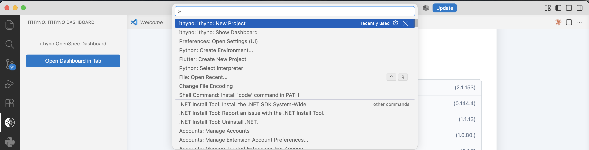{ loading=lazy }
      <figcaption>Run <strong>ithyno: New Project</strong> from the Command Palette.</figcaption>
    </figure>

    #### Open the dashboard in VS Code

    <figure markdown="span">
      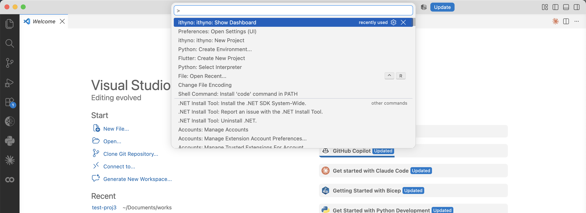{ loading=lazy }
      <figcaption>Run <strong>ithyno: Show Dashboard</strong> from the Command Palette.</figcaption>
    </figure>

=== "Electron App"

    1. Launch the ithyno app.
    2. On the welcome screen, select **Open Folder** and choose the folder you
       want to use. If another project is already open, you can instead use
       **File → New Project…**.
    3. For a folder without OpenSpec, select **Initialize openspec here**.
    4. Complete setup in the onboarding window, then select **Open Project**.
       The app switches to the initialized project and opens its dashboard.

    The app remembers recent projects, which can be reopened from
    **File → Open Recent**.

    #### Choose a project in the Electron App

    <figure markdown="span">
      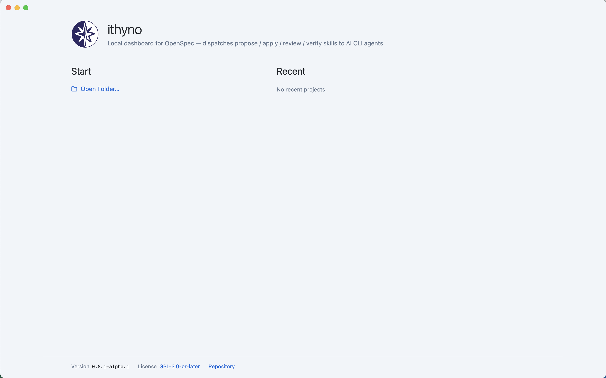{ loading=lazy }
      <figcaption>Select <strong>Open Folder</strong> on the Welcome screen.</figcaption>
    </figure>

    <figure markdown="span">
      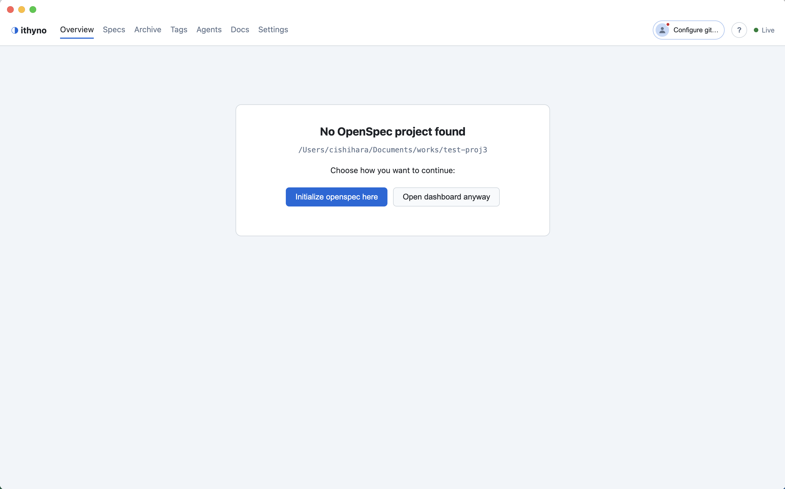{ loading=lazy }
      <figcaption>For a folder without OpenSpec, select <strong>Initialize openspec here</strong>.</figcaption>
    </figure>

## 2. Initialize the project

The onboarding screen checks the required tools and shows only installed,
Manager-capable agent CLIs in the Manager picker.

1. Confirm that Git, Node.js, and at least one supported agent CLI are
   available. Install or authenticate a missing agent CLI before continuing.
2. Select the CLI that will act as the **Manager**.
3. Select **Continue** and wait for every setup step to finish.

=== "VS Code Extension"

    <figure markdown="span">
      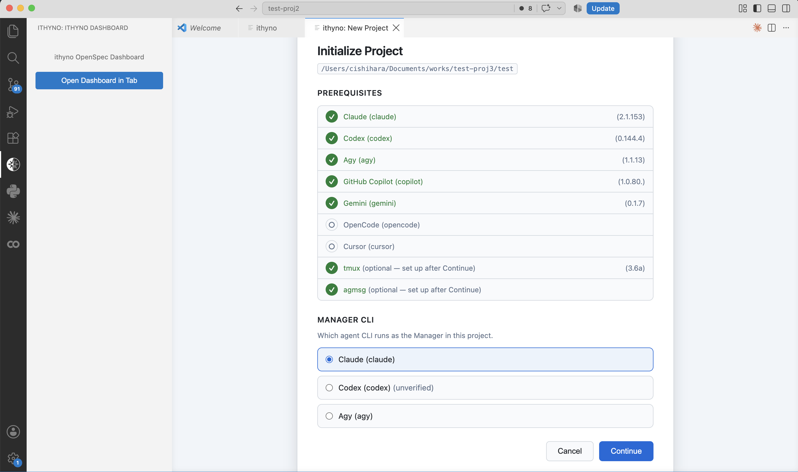{ loading=lazy }
      <figcaption>Confirm the prerequisites, choose the Manager CLI, and then select <strong>Continue</strong>.</figcaption>
    </figure>

    After initialization, the selected Manager runs in a VS Code terminal.
    Keep that terminal open while an agent is working.

    <figure markdown="span">
      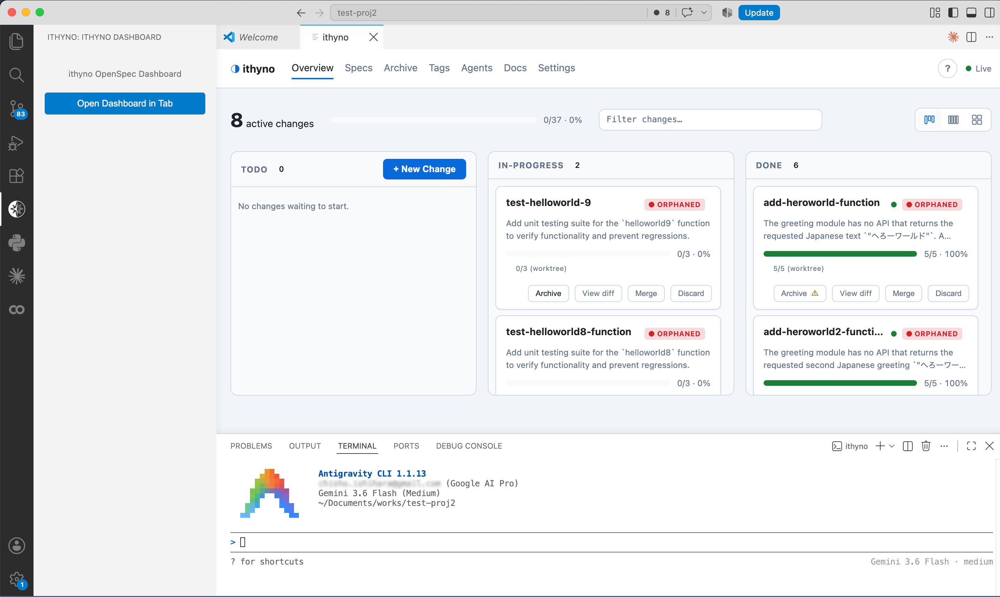{ loading=lazy }
      <figcaption>After choosing the Manager and completing initialization, keep the dashboard and Manager terminal open beside your editor.</figcaption>
    </figure>

=== "Electron App"

    <figure markdown="span">
      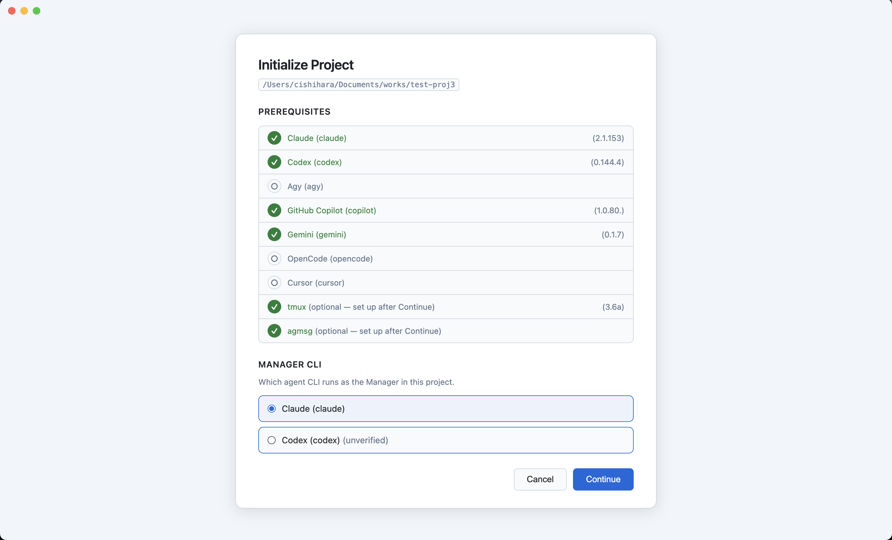{ loading=lazy }
      <figcaption>Confirm the detected tools and select the Manager CLI.</figcaption>
    </figure>

    <figure markdown="span">
      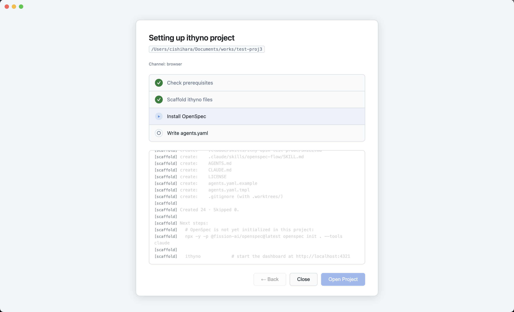{ loading=lazy }
      <figcaption>Select <strong>Continue</strong>, then wait until every initialization step is complete.</figcaption>
    </figure>

    After initialization, the selected Manager runs in ithyno's embedded
    terminal. Keep that terminal open while an agent is working.

    <figure markdown="span">
      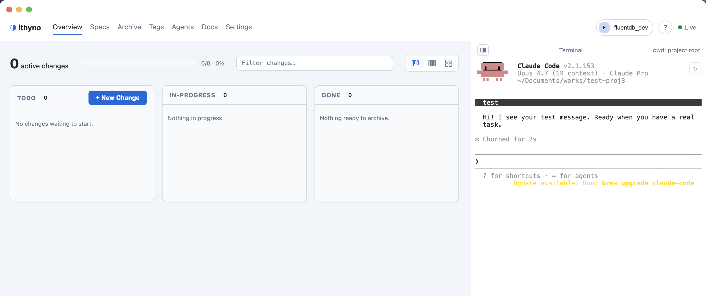{ loading=lazy }
      <figcaption>After initialization, the Electron App opens the dashboard and starts the selected Manager in its embedded terminal.</figcaption>
    </figure>

Initialization prepares the project for both OpenSpec and ithyno. It creates
the OpenSpec directories, `agents.yaml`, agent-facing skill files, and local
ithyno ignore entries. If the folder is not yet a Git repository, setup also
initializes Git.

## 3. Create the first change

1. From the dashboard, select **+ New Change**.
2. Describe one small outcome, for example:

   > Add a health-check endpoint that returns `{ "status": "ok" }`.

3. Let the Manager create the proposal, requirements, design, and task list.
4. Open the change and review the generated documents before starting work.
   Answer any questions shown as **Needs human**.

Keeping the first change small makes it easier to confirm that the selected
agent, permissions, and development tools are working correctly.

=== "VS Code Extension"

    <figure markdown="span">
      { loading=lazy }
      <figcaption>Select <strong>+ New Change</strong>, describe a small outcome, and send it to the Manager.</figcaption>
    </figure>

    <figure markdown="span">
      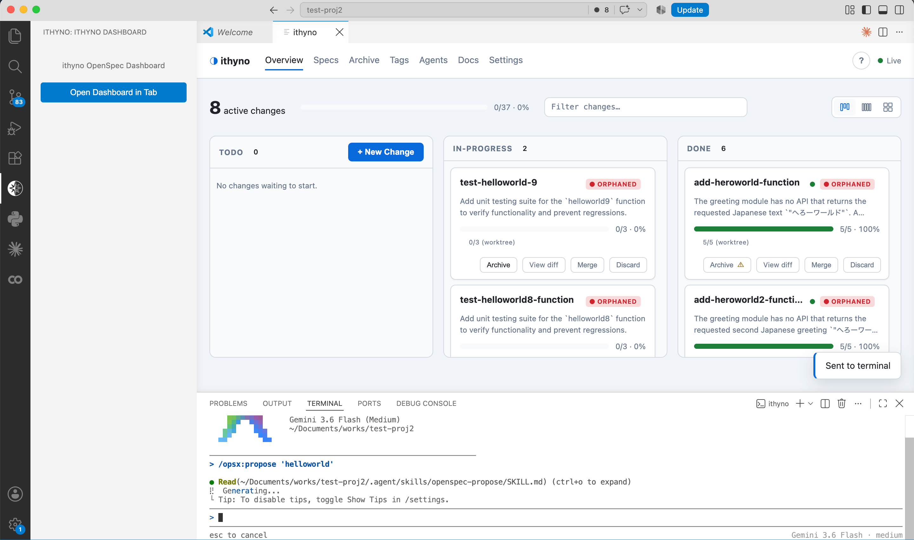{ loading=lazy }
      <figcaption>The proposal command is sent to the Manager terminal.</figcaption>
    </figure>

    <figure markdown="span">
      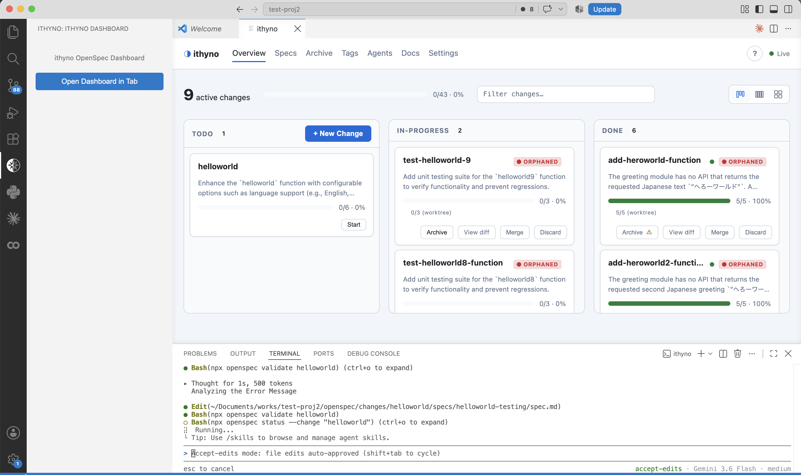{ loading=lazy }
      <figcaption>After proposal generation finishes, the change appears in the <strong>TODO</strong> lane.</figcaption>
    </figure>

=== "Electron App"

    <figure markdown="span">
      { loading=lazy }
      <figcaption>Select <strong>+ New Change</strong>, enter the first outcome, and send the generated proposal command.</figcaption>
    </figure>

    <figure markdown="span">
      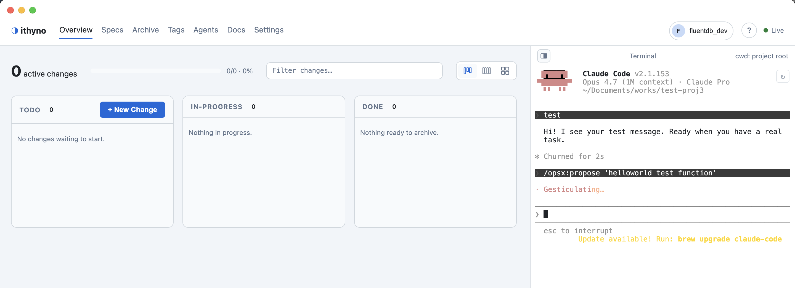{ loading=lazy }
      <figcaption>Keep the app open while the Manager generates and validates the proposal artifacts.</figcaption>
    </figure>

## 4. Start and monitor the work

1. Select **Start** on the change card.
2. Follow progress on the dashboard. With role-based agents configured, ithyno
   advances through code, review, and verify in order.
3. If the change returns to **Needs human** or requires rework, review the
   finding, answer it, and resume the change.
4. Inspect the completed diff and test results before merging or archiving.

=== "VS Code Extension"

    <figure markdown="span">
      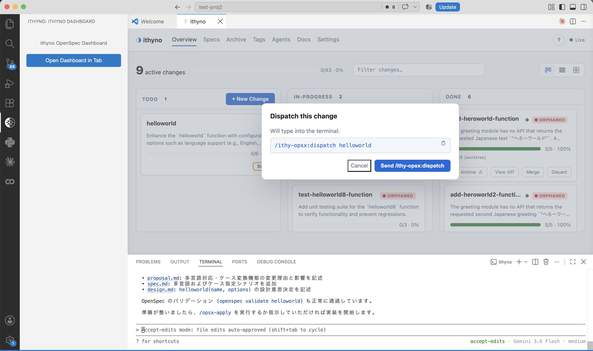{ loading=lazy }
      <figcaption>Select <strong>Start</strong> and confirm the dispatch command.</figcaption>
    </figure>

    <figure markdown="span">
      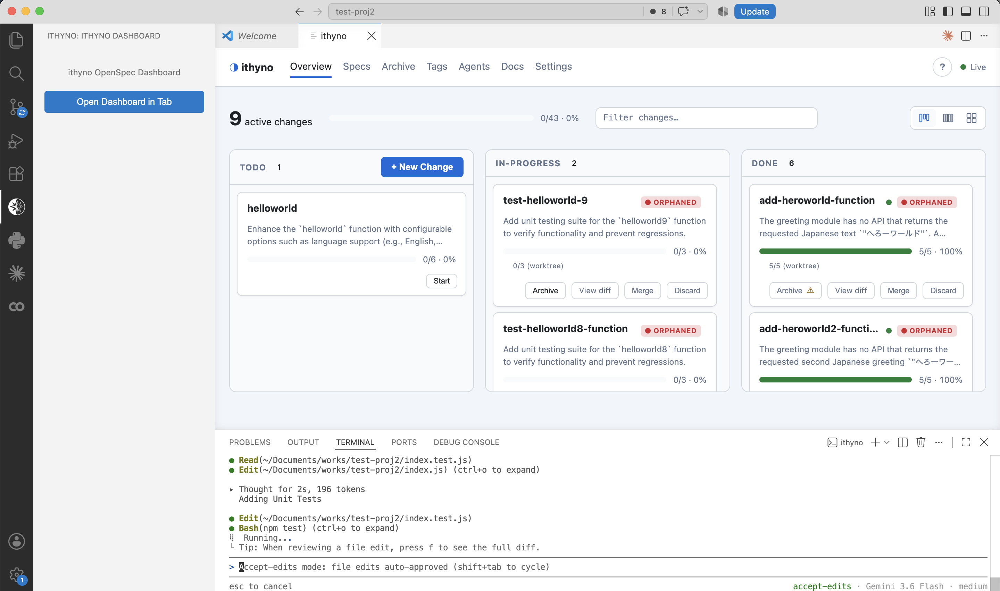{ loading=lazy }
      <figcaption>Monitor the Worker in the terminal and follow progress on the card.</figcaption>
    </figure>

=== "Electron App"

    <figure markdown="span">
      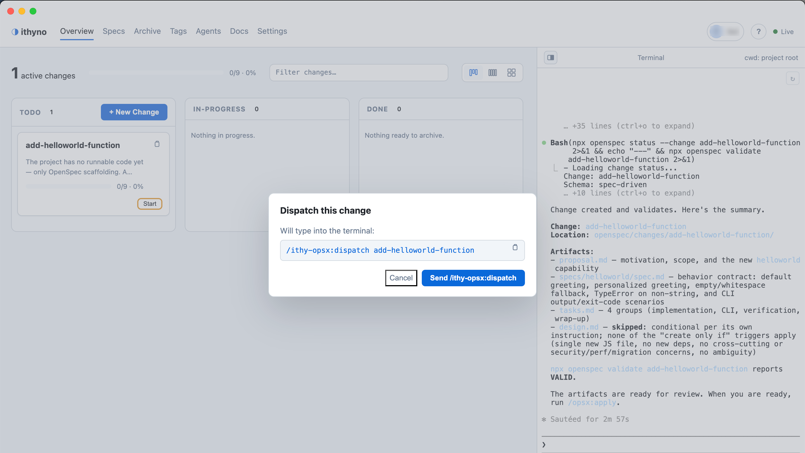{ loading=lazy }
      <figcaption>Select <strong>Start</strong>, review the command, and send it to the Manager.</figcaption>
    </figure>

    <figure markdown="span">
      { loading=lazy }
      <figcaption>The Manager begins dispatching the change while the card remains visible on the dashboard.</figcaption>
    </figure>

    <figure markdown="span">
      { loading=lazy }
      <figcaption>Use the Agent lane view to follow the active role and its change.</figcaption>
    </figure>

    <figure markdown="span">
      { loading=lazy }
      <figcaption>When every task is complete, inspect the result in the <strong>Done</strong> lane.</figcaption>
    </figure>

    <figure markdown="span">
      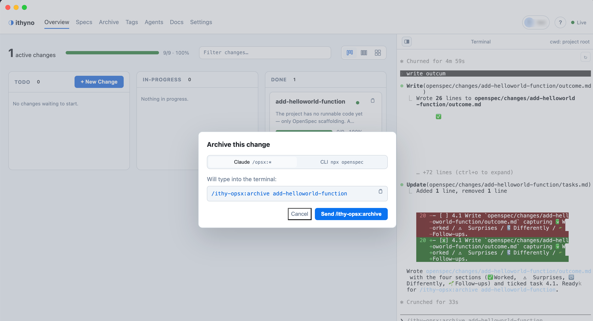{ loading=lazy }
      <figcaption>After reviewing the completed work, select <strong>Archive</strong> and confirm the archive command.</figcaption>
    </figure>

For a detailed description of initialization and importing an existing
codebase, see [Init & Import](user-manual-init-and-import.md). To add separate
code, review, and verify workers, continue with
[Set Up Multiple Agents and Dispatch a Change](multi-agent-setup-and-dispatch.md).
